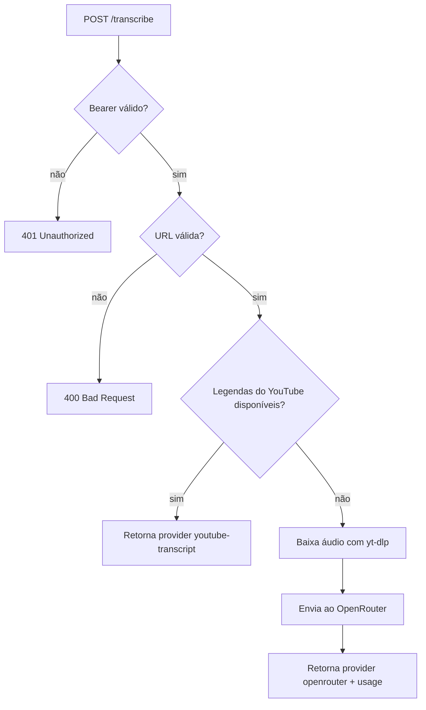

# YouTube Transcriber Server

Servidor HTTP em Node.js para transcrever vídeos do YouTube com autenticação Bearer.

Ele tenta primeiro as legendas do próprio YouTube. Se não houver transcrição disponível, baixa o áudio com `yt-dlp` e envia para o OpenRouter usando `openai/whisper-large-v3`.

## Destaques

- `POST /transcribe` com `Authorization: Bearer <sua-chave>`.
- Fallback automático entre `youtube-transcript` e OpenRouter.
- Resposta em JSON com `provider`, `method`, `generatedAt` e, quando o provedor for OpenRouter, `usage`.
- `GET /health` para health check em Coolify, Docker e balanceadores.
- Pronto para rodar com `npm`, Docker ou Docker Compose.

## Como funciona



## Requisitos

- Node.js 18+.
- `yt-dlp` instalado no sistema ou dentro do container.
- `ffmpeg` disponível para o fluxo de áudio.
- Uma `AUTH_BEARER_KEY` para proteger a rota.
- Uma `OPENROUTER_API_KEY` para o fallback de transcrição por áudio.

## Instalação

```bash
npm install
```

Crie um arquivo `.env` na raiz do projeto com este formato:

```env
PORT=6969
AUTH_BEARER_KEY=troque-esta-chave
OPENROUTER_API_KEY=sua-chave-openrouter
OPENROUTER_MODEL=openai/whisper-large-v3
```

## Rodando localmente

```bash
npm run dev
```

O servidor sobe em `http://localhost:6969`.

## Health Check

Use esta rota para o Coolify ou para monitoramento simples:

```http
GET /health
```

Resposta:

```json
{
  "ok": true,
  "details": "Server running"
}
```

## API

### `POST /transcribe`

Headers obrigatórios:

```http
Authorization: Bearer <sua-chave>
Content-Type: application/json
Accept: application/json
```

Body mínimo:

```json
{
  "url": "https://www.youtube.com/watch?v=dQw4w9WgXcQ"
}
```

Body com idioma para o OpenRouter:

```json
{
  "url": "https://www.youtube.com/watch?v=dQw4w9WgXcQ",
  "language_openrouter": "pt"
}
```

Se quiser baixar o JSON como arquivo, use `?download=true` na URL ou envie `download: true` no body.

## Resposta de sucesso

O retorno tem dois formatos possíveis, dependendo do provedor usado.

### Quando vier de legendas do YouTube

```json
{
  "ok": true,
  "videoId": "dQw4w9WgXcQ",
  "sourceUrl": "https://www.youtube.com/watch?v=dQw4w9WgXcQ",
  "provider": "youtube-transcript",
  "method": "youtube-transcript",
  "transcript": "texto completo da transcrição",
  "language": "pt",
  "generatedAt": "2026-05-25T12:34:56.000Z"
}
```

### Quando vier do OpenRouter

```json
{
  "ok": true,
  "videoId": "dQw4w9WgXcQ",
  "sourceUrl": "https://www.youtube.com/watch?v=dQw4w9WgXcQ",
  "provider": "openrouter",
  "method": "openrouter",
  "transcript": "texto completo da transcrição",
  "usage": {
    "input_tokens": 123,
    "output_tokens": 456,
    "total_tokens": 579
  },
  "generatedAt": "2026-05-25T12:34:56.000Z"
}
```

## Resposta de erro

```json
{
  "ok": false,
  "error": "URL inválida ou não reconhecida: invalid"
}
```

Alguns erros também podem incluir `details`.

## Exemplo com `curl`

```bash
curl -X POST "http://localhost:6969/transcribe" \
  -H "Authorization: Bearer teste" \
  -H "Content-Type: application/json" \
  -H "Accept: application/json" \
  -d '{"url":"https://www.youtube.com/watch?v=dQw4w9WgXcQ","language_openrouter":"pt"}'
```

Para baixar como arquivo:

```bash
curl -X POST "http://localhost:6969/transcribe?download=true" \
  -H "Authorization: Bearer teste" \
  -H "Content-Type: application/json" \
  -H "Accept: application/json" \
  -d '{"url":"https://www.youtube.com/watch?v=dQw4w9WgXcQ"}' \
  -o transcription.json
```

## Docker

### Build e execução

```bash
docker build -t yt-transcriber .
docker run --rm -p 6969:6969 --env-file .env yt-transcriber
```

### Docker Compose

```bash
docker compose up --build
```

O Compose já expõe a porta `6969` e lê o arquivo `.env` da raiz.

## Coolify

Você pode subir este projeto no Coolify usando o repositório direto.

### Opção recomendada

- Use o `Dockerfile` existente.
- Configure a porta interna como `6969`.
- Adicione as variáveis de ambiente no painel do Coolify.
- Aponte o health check para `GET /health`.

### Variáveis necessárias

- `AUTH_BEARER_KEY`
- `OPENROUTER_API_KEY`
- `OPENROUTER_MODEL` opcional
- `PORT` opcional, padrão `6969`

## Observações importantes

- A rota aceita no máximo `1 MB` no corpo da requisição, o suficiente para enviar a URL e parâmetros.
- O retorno pode ser grande se a transcrição for longa, mas a API responde em JSON normal.
- Se a legenda do YouTube estiver disponível, o OpenRouter não é usado.
- Se a transcrição cair no OpenRouter, o campo `usage` vem no retorno.

## Estrutura do projeto

```text
.
├── Dockerfile
├── docker-compose.yml
├── package.json
├── README.md
├── src/
│   └── yt.ts
└── tsconfig.json
```

## Scripts

```bash
npm run dev
npm run start
npm run typecheck
```

## Licença

ISC
